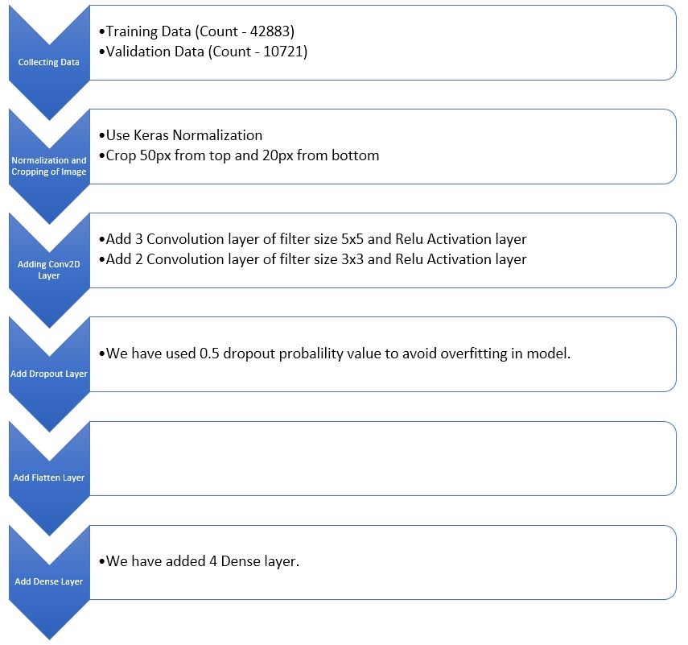
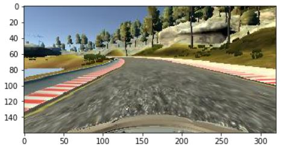
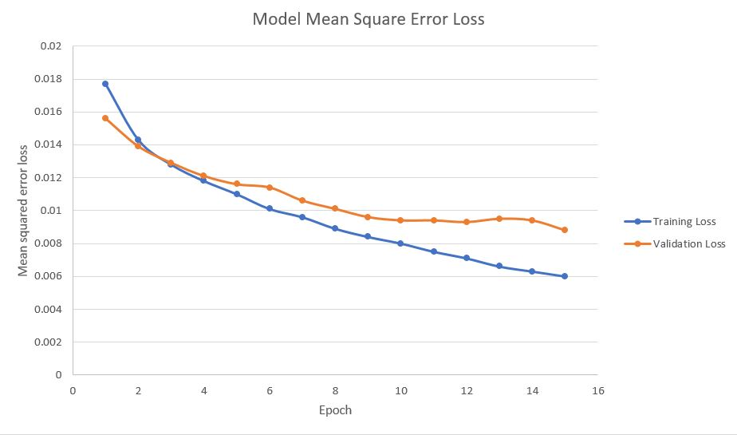

# **Behavioral Cloning** 

**Behavioral Cloning Project**

The goals / steps of this project are the following:
* Use the simulator to collect data of good driving behavior
* Build, a convolution neural network in Keras that predicts steering angles from images
* Train and validate the model with a training and validation set
* Test that the model successfully drives around track one without leaving the road
* Summarize the results with a written report

## Rubric Points
### Here I will consider the [rubric points](https://review.udacity.com/#!/rubrics/432/view) individually and describe how I addressed each point in my implementation.  

---
### Files Submitted & Code Quality

#### 1. Submission includes all required files and can be used to run the simulator in autonomous mode

My project includes the following files:
* model.py containing the script to create and train the model
* drive.py for driving the car in autonomous mode
* model.h5 containing a trained convolution neural network 
* writeup_report.md or writeup_report.pdf summarizing the results

#### 2. Submission includes functional code
Using the Udacity provided simulator and my drive.py file, the car can be driven autonomously around the track by executing 
```sh
python drive.py model.h5
```

#### 3. Submission code is usable and readable

The model.py file contains the code for training and saving the convolution neural network. The file shows the pipeline I used for training and validating the model, and it contains comments to explain how the code works.

### Model Architecture and Training Strategy

#### 1. An appropriate model architecture has been employed

I used [nVidia Autonomous Car Group](https://devblogs.nvidia.com/parallelforall/deep-learning-self-driving-cars/) model for training the images.
My model consists of a convolution neural network with mix filter size of 5x5 and 3x3 and depths between 24 and 128. 

The model includes RELU layers to introduce nonlinearity (code line 20), and the data is normalized in the model using a Keras lambda layer [this part of the code](model.py#L100). We cropped the image to remove un-necessary data from the image ([Code](model.py#L101)). 

A model summary is as follows:

```
Layer (type)                     Output Shape                Connected to                     
====================================================================================================
lambda_1 (Lambda)                (160, 320, 3)               lambda_input_2[0][0]             
____________________________________________________________________________________________________
cropping2d_1 (Cropping2D)        (90, 320, 3)                lambda_1[0][0]                   
____________________________________________________________________________________________________
convolution2d_1 (Convolution2D)  (43, 158, 24)               cropping2d_1[0][0]               
____________________________________________________________________________________________________
convolution2d_2 (Convolution2D)  (20, 77, 36)                convolution2d_1[0][0]            
____________________________________________________________________________________________________
convolution2d_3 (Convolution2D)  (8, 37, 48)                 convolution2d_2[0][0]            
____________________________________________________________________________________________________
convolution2d_4 (Convolution2D)  (6, 35, 64)                 convolution2d_3[0][0]            
____________________________________________________________________________________________________
convolution2d_5 (Convolution2D)  (4, 33, 64)                 convolution2d_4[0][0]            
____________________________________________________________________________________________________
flatten_1 (Flatten)              (8448)                      convolution2d_5[0][0]            
____________________________________________________________________________________________________
dense_1 (Dense)                  (100)                       flatten_1[0][0]                  
____________________________________________________________________________________________________
dense_2 (Dense)                  (50)                        dense_1[0][0]                    
____________________________________________________________________________________________________
dense_3 (Dense)                  (10)                        dense_2[0][0]                    
____________________________________________________________________________________________________
dense_4 (Dense)                  (1)                         dense_3[0][0]                    
====================================================================================================

```


#### 2. Attempts to reduce overfitting in the model

The model contains dropout layers in order to reduce overfitting (model.py lines 21). 

In addition to that, I split my sample data into training and validation data. Using 80% as training and 20% as validation. This can be seen at [this part of the code](model.py#L59) to ensure that the model was not overfitting. 
The model was tested by running it through the simulator and ensuring that the vehicle could stay on the track.

#### 3. Model parameter tuning

The model used an adam optimizer, so the learning rate was not tuned manually ([Code](model.py#L122)).

#### 4. Appropriate training data

Training data was chosen to keep the vehicle driving on the road. I used a combination of center lane driving, left, right and flipping of images for training of model.
I used the dataset provided by Udacity. This dataset contains images from 3 cameras (left, center and right). I used all these 3 camera images to train my model.

For details about how I created the training data, see the next section. 

### Model Architecture and Training Strategy

#### 1. Solution Design Approach

The overall strategy for deriving a model architecture was to create such model which keep vehicle on the track.

My first step was to use a convolution neural network model similar to the [nVidia Autonomous Car Group](https://devblogs.nvidia.com/parallelforall/deep-learning-self-driving-cars/). Modification which i did in this model was to add dropout layer before flatten layer in-order to reduce overfitting ([Code](model.py#L115)).
The final step was to run the simulator to see how well the car was driving around track one. There were a few spots where the vehicle fell off the track. To improve the driving behavior in these cases. I added more images for the training of model. 
I used Image augmentation technique to add more data by adding the same image flipped with a negative angle ([Code](model.py#L46-L54)). In addition to that, the left and right camera images where introduced with a correction factor on the angle to help the car go back to the lane ([Code](model.py#L31-L33)).

At the end of the process, the vehicle is able to drive autonomously around the track without leaving the road.

#### 2. Final Model Architecture

The final model architecture ([Final Architecture](model.py#L97-L124)) consisted of a convolution neural network with the following layers.

Here is a visualization of the architecture.



#### 3. Creation of the Training Set & Training Process

To capture good driving behavior, I recorded two laps on track one using center lane driving. Here is an example image of center lane driving:
##### Center Camera Image

##### Left Camera Image

##### Right Camera Image


To augment the data sat, I also flipped images and angles thinking that this would increase the data set and reduce error loss. For example, here is an image that has then been flipped:
##### Original and Flipped Images
 


After the collection process, I had 53604 number of data points. I then preprocessed this data by keras Normalization technique and Cropped the images 50px from top and 20px from bottom.


I finally randomly shuffled the data set and put 20% of the data into a validation set. Below picture shows the training.


I used this training data for training the model. The validation set helped determine if the model was over or under fitting. The ideal number of epochs was 15. I used an adam optimizer so that manually training the learning rate wasn't necessary.
