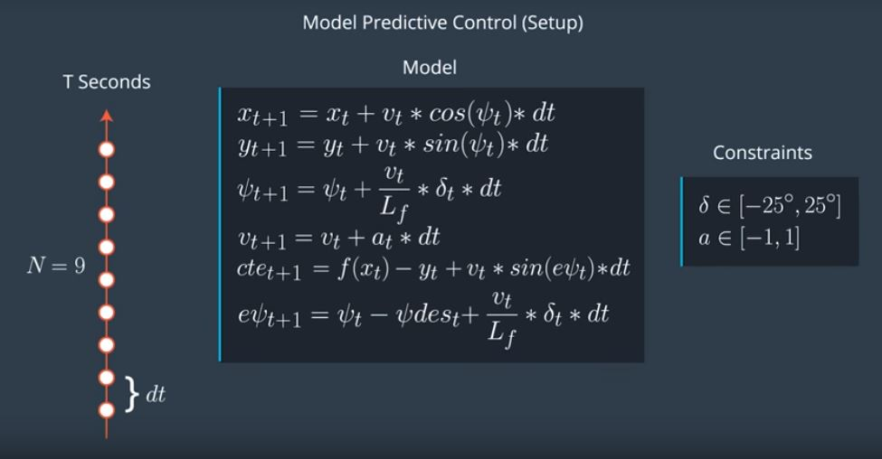

## CarND-MPC-Project

### What is Model Predictive Control ?

The MPC considers the task of following a trajectory as an optimization problem in which the solution is the path the car should take. The idea is to simulate different actuator inputs (steering, acceleration and braking) and predict a resulting trajectory by selecting the one with the minimum cost. The car follows that trajectory and gets new input to calculate a new set of trajectories to optimize. The model utilizes the called “receding horizon controller” which performs a trajectory recalculation for every new state, since the defined trajectory is just an approximation.

### The Model -

Below image shows all the Kinematic equation used to predict the new state of a car.

### Trajectory

I have used **N** = 10 and **dt** = 0.1

The trajectory parameters are the number of time steps N separated in time bydt. It’s not necessary to use a large number of steps since the algorithm recalculates the trajectory on every step. Besides, a large N is more costly to compute. Running the algorithm with values greater than 20 caused the car to go off-track. Same for dt, smaller time steps are more costly but larger values mean a lot of things happen between each calculation. Larger values, of for example, 0.1 caused the car run off-track.

### Polynomial Fitting

First we have to convert the given waypoints from MAp CO-ordinate system to Car Co-ordinate system.
          
          vector<double> ptsx = j[1]["ptsx"];
          vector<double> ptsy = j[1]["ptsy"];
          
          for(int i=0;i<ptsx.size();i++)
          {
            double shift_x = ptsx[i] - px;
            double shift_y = ptsy[i] - py;

            ptsx[i] = (shift_x*cos(0-psi) - shift_y*sin(0-psi));
            ptsy[i] = (shift_x*sin(0-psi) + shift_y*cos(0-psi));
          }

          double* ptrx = &ptsx[0];
          Eigen::Map<Eigen::VectorXd> ptsx_transform(ptrx, 6);

          double* ptry = &ptsy[0];
          Eigen::Map<Eigen::VectorXd> ptsy_transform(ptry, 6);
          
          
Below are the equations used to find the Yellow line. We are using 3rd order polynomial to fit the given waypoints.

          // Polynomial Fitting from given waypoints
          auto coeffs = polyfit(ptsx_transform, ptsy_transform, 3);
          //calculate cte and epsi
          double cte = polyeval(coeffs,0);
          // double epsi = psi - atan(coeffs[1] + 2*coeffs[2]*px + 3*coeff[3]*pow(px,2))
          double epsi = -atan(coeffs[1]);
 
 ### Handling the Latency
 
In a real car, an actuation command won't execute instantly - there will be a delay as the command propagates through the system. A realistic delay might be on the order of 100 milliseconds.

This is a problem called "latency", and it's a difficult challenge for some controllers - like a PID controller - to overcome. But a Model Predictive Controller can adapt quite well because we can model this latency in the system.

A contributing factor to latency is actuator dynamics. For example the time elapsed between when you command a steering angle to when that angle is actually achieved. This could easily be modeled by a simple dynamic system and incorporated into the vehicle model. One approach would be running a simulation using the vehicle model starting from the current state for the duration of the latency. The resulting state from the simulation is the new initial state for MPC.

          const double act_latency=0.1;

          const double current_px = 0.0 + v * act_latency;
          const double current_py = 0.0;
          const double current_psi = 0.0 + v * (-delta) / Lf * act_latency;
          const double current_v = v + a * act_latency;
          const double current_cte = cte + v * sin(epsi) * act_latency;
          const double current_epsi = epsi + v * (-delta) / Lf * act_latency;

          state << current_px, 0, current_psi, current_v, current_cte, current_epsi;
 
