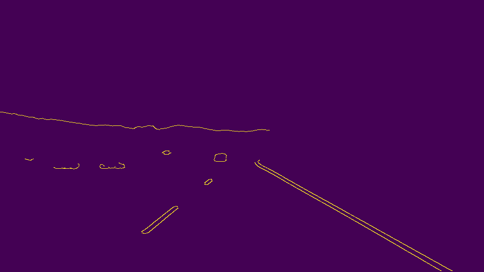
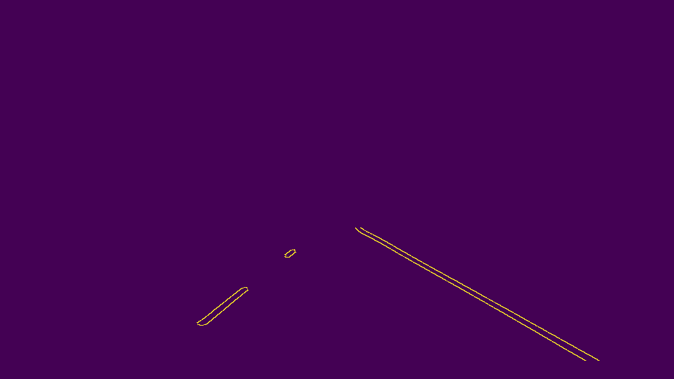

# **Lane Lines finding on the Road** 
---

The pipeline which i have designed consist of below steps:

  1. We iterate through all test images and make a copy of original image so that it will not affect the original image and apply owr pipeline on copied image.
  
  

  
  2. GrayScale helper function provided is applied on the image.
  
  

  
  3. Apply Gaussian blur helper function on image of kernal size of 15. This step will smoothed the grayscale image.
  4. Canny Edge Detection function is used to detect image's edges, with a ratio of 1:3 through a low_threshold @ 50 and a
      high threshold @ 150.
      
      

      
  5. Polygon mask is used here for regional masking in which 4 vertices of polygon is calculated . Using approximate ratios with respect to
      the image's specific dimensions calculated by variables cols & rows.
      
      

      
  6. Using the Hough Lines function, determining the lines connecting the Edge points previously collected through the Canny function. These lines were filtered according to several parameters, including: the minimum line length and maximum line gap.
  
  7. These lines are passed to the draw_lines function to be drawn on a blank image with the same dimensions as the input.
      * The points were filtered to two seperate arrays representing the left and the right lanes by dividing the lines on the left               of the image and on the right.
      * The functions polyfit, poly1d and polylines were used to get a fitting set of points for the lines set as the left and right lane, create a function of the first degree for the fitting points, and draw a line across the points specifying the left and right lanes. 
  
  8. Merged the lines drawn and input image together using the weighted image function, to display the drawn lanes marked by *the red lines* on the input image.
  
  

  
### Potential Shortcomings

The pipeline proposed might have several shortcomings, which would cause some error in determining the lanes.  
These shortcomings might occur under certain conditions:  
  1. Extremely high or low lighting.
  2. Shadows
  3. It is not working properly for challenging video.
  
  * All these conditions would might cause a distortion in the pipeline's algorithm since it detects the lines available in a specified region infront of the car for specific color and for curves line this might not work accuratly.

### Possible Improvements

There are lot of improvement needed for the designed pipeline. We may combine robotic and deep learning approach to find the lane more accurately in the image and video.
