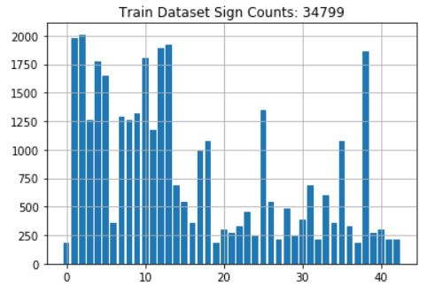
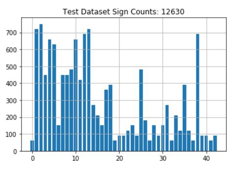
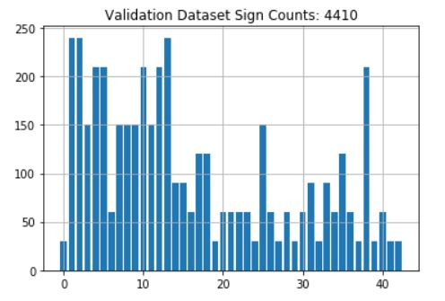
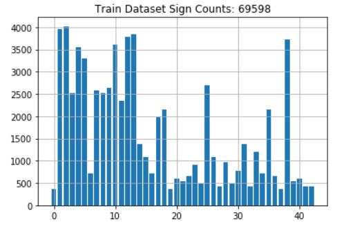

# **Traffic Sign Recognition** 

## Writeup

### You can use this file as a template for your writeup if you want to submit it as a markdown file, but feel free to use some other method and submit a pdf if you prefer.

---

**Build a Traffic Sign Recognition Project**

The goals / steps of this project are the following:
* Load the data set (see below for links to the project data set)
* Explore, summarize and visualize the data set
* Design, train and test a model architecture
* Use the model to make predictions on new images
* Analyze the softmax probabilities of the new images
* Summarize the results with a written report

## Rubric Points
### Here I will consider the [rubric points](https://review.udacity.com/#!/rubrics/481/view) individually and describe how I addressed each point in my implementation.  

---
### Writeup / README

#### 1. Provide a Writeup / README that includes all the rubric points and how you addressed each one. You can submit your writeup as markdown or pdf. You can use this template as a guide for writing the report. The submission includes the project code.

You're reading it! and here is a link to my [project code](https://github.com/udacity/CarND-Traffic-Sign-Classifier-Project/blob/master/Traffic_Sign_Classifier.ipynb)

### Data Set Summary & Exploration

#### 1. Provide a basic summary of the data set. In the code, the analysis should be done using python, numpy and/or pandas methods rather than hardcoding results manually.

I used the pandas library to calculate summary statistics of the traffic
signs data set:

* The size of training set is 69598
* The size of the validation set is 4410
* The size of test set is 12630
* The shape of a traffic sign image is 32x32x3
* The number of unique classes/labels in the data set is 43

#### 2. Include an exploratory visualization of the dataset.

Here is an exploratory visualization of the data set. It is a bar chart showing how the data ...
##### Training Data

##### Testing Data

##### Validation Data

### Design and Test a Model Architecture

#### 1. Describe how you preprocessed the image data. What techniques were chosen and why did you choose these techniques? Consider including images showing the output of each preprocessing technique. Pre-processing refers to techniques such as converting to grayscale, normalization, etc. (OPTIONAL: As described in the "Stand Out Suggestions" part of the rubric, if you generated additional data for training, describe why you decided to generate additional data, how you generated the data, and provide example images of the additional data. Then describe the characteristics of the augmented training set like number of images in the set, number of images for each class, etc.)

As a first step, I decided to convert the images to grayscale because color images doesn't provide edges inside the images which plays a vital role in classification.

Here is an example of a traffic sign image before and after grayscaling.

##### Grayscaling

As a last step, I normalized the image data because normalization makes the input data in comparable range, which helps sigmoid activation function.

I decided to generate additional data because it helps to increase training accuracy by adding some extra images having different angle of rotation, noises which may be available in real life examples. 

To add more data to the the data set, I used angle rotation technique because traffic sign sometime are little bit elevated on different turns. 

Here is an example of an augmented image:

The difference between the original data set and the augmented data set is the following ... 
We have doubled the training image dataset by adding augmented image.

#### 2. Describe what your final model architecture looks like including model type, layers, layer sizes, connectivity, etc.) Consider including a diagram and/or table describing the final model.

My final model consisted of the following layers:

| Layer         		|     Description	        					| Input |Output| 
|:---------------------:|:---------------------------------------------:| :----:|:-----:|
| Convolution 5x5     	| 1x1 stride, valid padding, RELU activation 	|**32x32x1**|28x28x6|
| Max pooling			| 2x2 stride, 2x2 window						|28x28x6|14x14x6|
| Convolution 5x5 	    | 1x1 stride, valid padding, RELU activation 	|14x14x6|10x10x16|
| Max pooling			| 2x2 stride, 2x2 window	   					|10x10x16|5x5x16|
| Flatten				| 3 dimensions -> 1 dimension					|5x5x16| 400|
| Fully Connected | connect every neuron from layer above	followed by activation function		|400|120|
| Fully Connected | connect every neuron from layer above	followed by activation function			|120|84|
| Fully Connected | output = number of traffic signs in data set	|84|**43**|

#### 3. Describe how you trained your model. The discussion can include the type of optimizer, the batch size, number of epochs and any hyperparameters such as learning rate.

To train the model, I used an NVIDIA Geforce AWS EC2 instance provided by udacity. Speed was pretty much fast as compared to out local PCs.

Here are my final training parameters:
* EPOCHS = 25
* BATCH_SIZE = 128
* SIGMA = 0.1
* OPIMIZER: AdamOptimizer (learning rate = 0.001)

My results after training the model:
* Validation Accuracy = **93.01%**
* Test Accuracy = **91.78%**

#### My Approach for opting this Model.

I have taken the reference of LetNet project which was in our course. I have started with 32x32x3 image shape. I have applied some pre-processing techniques like grayscaling and normalization but validation accuracy was not more than 93% so i tried by adding some faked images using augmentation technique and it increased the accuracy of my model. I have observed that accuracy was not increasing significantly after 35 EPOCHS so i restricted my model for 25 EPOCH. 

### Test a Model on New Images

Here are five German traffic signs that I found on the web:

          

Here are the results of the prediction:

| Image			        |     Prediction	        					| 
|:---------------------:|:---------------------------------------------:| 
| Right-of-way at the next intersection      		| Right-of-way at the next intersection   									| 
| Bumpy Road     			| Road Work										|
| Keep Right					| Keep Right											|
| Priority Road	      		| Priority Road						 				|
| Go staright or left			| Go staright or left      							|
| General Caution			| General Caution      							|

The model was able to correctly guess 5 of the 6 traffic signs, which gives an accuracy of 83.3%. 

#### Drawback on web images

The images which i had taken from the webs are very accurate based on our training data set. What can be done further is to take any random image and apply this model for validation.

