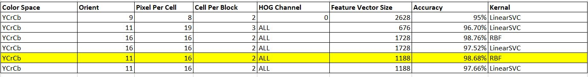
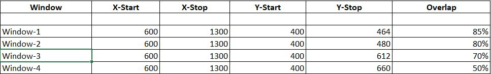
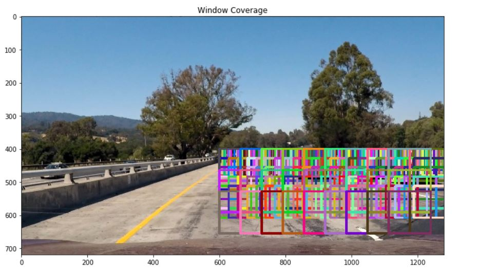
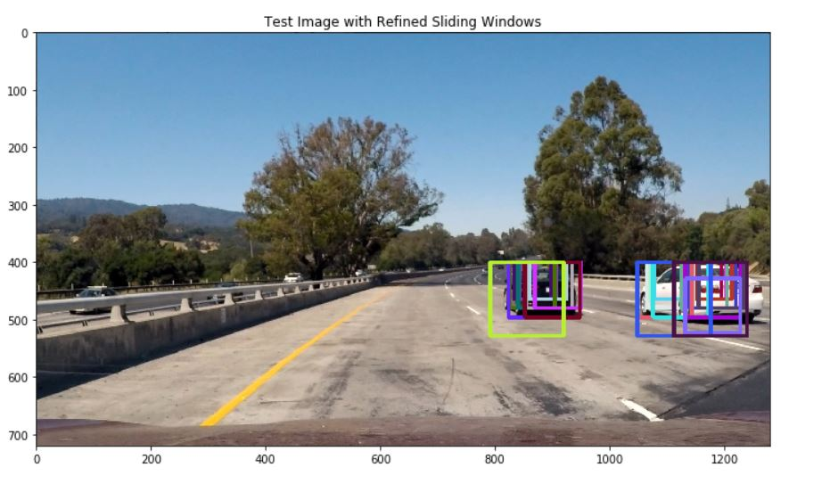

**Vehicle Detection Project**

The goals / steps of this project are the following:

* Perform a Histogram of Oriented Gradients (HOG) feature extraction on a labeled training set of images and train a classifier SVM classifier using RBF kernel.
* Optionally, you can also apply a color transform and append binned color features, as well as histograms of color, to your HOG feature vector. 
* Note: for those first two steps don't forget to normalize your features and randomize a selection for training and testing.
* Implement a sliding-window technique and use your trained classifier to search for vehicles in images.
* Run your pipeline on a video stream (start with the test_video.mp4 and later implement on full project_video.mp4) and create a heat map of recurring detections frame by frame to reject outliers and follow detected vehicles.
* Estimate a bounding box for vehicles detected.

### Here I will consider the rubric points individually and describe how I addressed each point in my implementation.  

### Histogram of Oriented Gradients (HOG)

#### 1. Explain how (and identify where in your code) you extracted HOG features from the training images.

The code for this step is contained in the fourth code cell of the IPython notebook (`Vehicle_detection.ipynb`).  

I started by reading in all the `vehicle` and `non-vehicle` images.  Here is an example of one of each of the `vehicle` and `non-vehicle` classes:

I then explored different color spaces and different `skimage.hog()` parameters (`orientations`, `pixels_per_cell`, and `cells_per_block`).  I grabbed random images from each of the two classes and displayed them to get a feel for what the `skimage.hog()` output looks like.

Here is an example using the `YCrCb` color space and HOG parameters of `orientations=8`, `pixels_per_cell=(8, 8)` and `cells_per_block=(2, 2)`:

#### 2. Explain how you settled on your final choice of HOG parameters.

I tried various combinations of parameters and come up below highlighted parameter for training my model. Lot of parameters i have tried few are mentioned below in tables.

##### Note: I have used 98.68% accuracy instead of 98.76% because no of features are less for this. So this will take less time to get prediction for new data.

#### 3. Describe how (and identify where in your code) you trained a classifier using your selected HOG features (and color features if you used them).

I trained a RBF SVM using using HOG classifier. I haven't used Spatial binning and Color histogram because using this both classifier is making much of difference. Code is mentioned in 6th Cell of IPython notebook.

    svc = svm.SVC(kernel='rbf')
    t=time.time()
    svc.fit(X_train, y_train)
    t2 = time.time()
    print(round(t2-t, 2), 'Seconds to train SVC...')
    pickle.dump( svc, open( "svc.p", "wb" ) )
    print('Test Accuracy of SVC = ', round(svc.score(X_test, y_test), 4))

### Sliding Window Search

#### 1. Describe how (and identify where in your code) you implemented a sliding window search.  How did you decide what scales to search and how much to overlap windows?

Sliding window and finding hot windows are described into ( 7th and 10th Cell ) of notebbok. Sliding window are used to detect the cars into the frame. I have used 4 windows of different window size to detect the car. More the density of windows more accuractly we will detect the car. 

**Windows**

**Sliding Window**

**Hot Windows**

#### Note: X-Start=600 because most of the cars in the frames are on the right side of frames.

#### 2. Show some examples of test images to demonstrate how your pipeline is working.  What did you do to optimize the performance of your classifier?

Ultimately I searched on YCrCb ALL-channel HOG features, which provided a nice result with less no. of parameter features.  Here are some example images:

---

### Video Implementation

#### 1. Provide a link to your final video output.  Your pipeline should perform reasonably well on the entire project video (somewhat wobbly or unstable bounding boxes are ok as long as you are identifying the vehicles most of the time with minimal false positives.)
Here's a [link to my video result](project_video_output.mp4)

#### 2. Describe how (and identify where in your code) you implemented some kind of filter for false positives and some method for combining overlapping bounding boxes.

I recorded the positions of positive detections in each frame of the video.  From the positive detections I created a heatmap and then thresholded that map to identify vehicle positions.  

**Heatmap**

**Averaging**

I have used averaging method for smoothness. I have used 15 previous hot windows and stored it in the array. These hot windows are used with recent detected windows. Below is the code to demostrate it.

    class Detect_Vehicle():
    
        def __init__(self):
            ## Previous detected frames
            self.prev_rects=[]
    
        def add_rects(self,rects):
            self.prev_rects.append(rects)
            if len(self.prev_rects)>15:
                self.prev_rects=self.prev_rects[len(self.prev_rects)-15:]

---

### Discussion

#### 1. Briefly discuss any problems / issues you faced in your implementation of this project.  Where will your pipeline likely fail?  What could you do to make it more robust?

Issue i faced  during making final pipeline.

* Very small size windows were detected near the dashboard of car. I have removed it by logic that large frame will come near car only. Small frames cann't come near dashboard so i have removed those windows from hot windows list.

* Windows were fluctuating lot so i have added averaging technique to resolve this.

* Still getting some false postive where my pipeline is failing. Will check on thresholding to resolve this.

